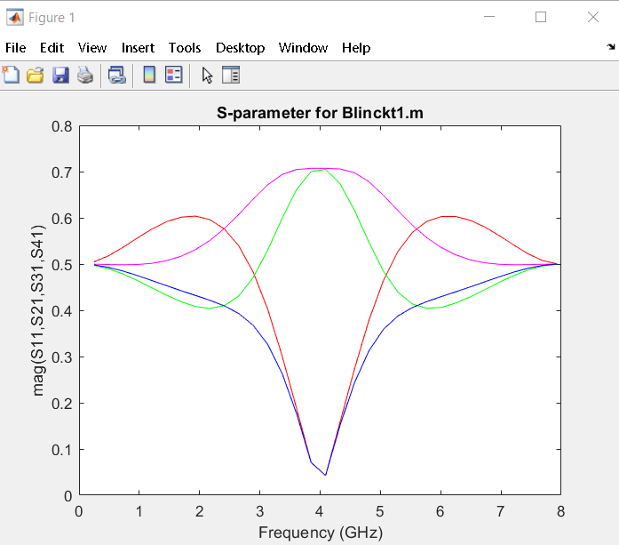

# Y-Matrix Approach

General N-port linear RF/microwave circuit analysis in Matlab. Modernized the Matlab methods described in Chapter 6 of "Computer-Aided Analysis of Linear Circuits" by M. L. Edwards published in September 2001.  The library includes RES, IND, CAP, SRLC (series RLC), TLIN, TLOC, and TLSC. Code was tested in Matlab R2018B.

